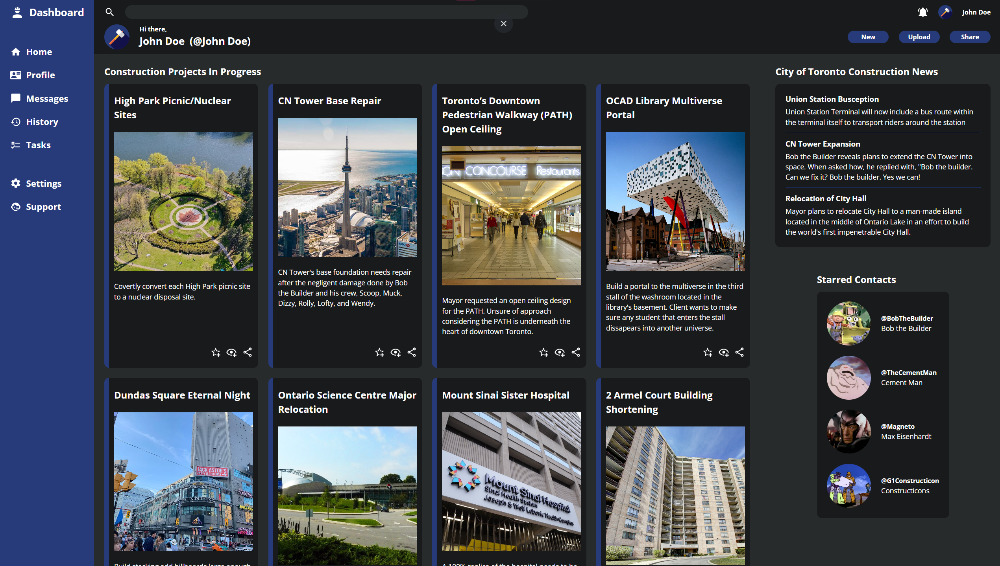
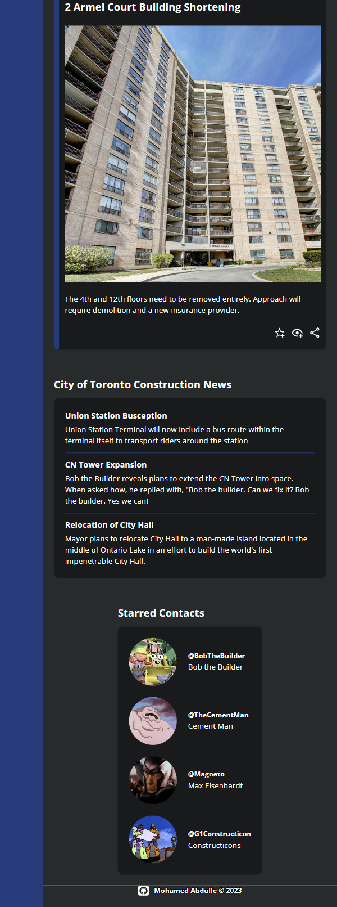

# Admin Dashboard

This is a sample admin dashboard for construction project managers.

### Full View:

 

### Mobile View:

Start of Page             |  End of Page
:-------------------------:|:-------------------------:
|

## Links
- [Click here to see the admin dashboard live.](https://mohamedabdulle.github.io/admin-dashboard/)

- [Link to the assignment details.](https://www.theodinproject.com/lessons/node-path-intermediate-html-and-css-admin-dashboard)

## Description

The purpose of this project is to create an admin dashboard with a responsive grid layout and with as little use of flexbox (For learning purposes).